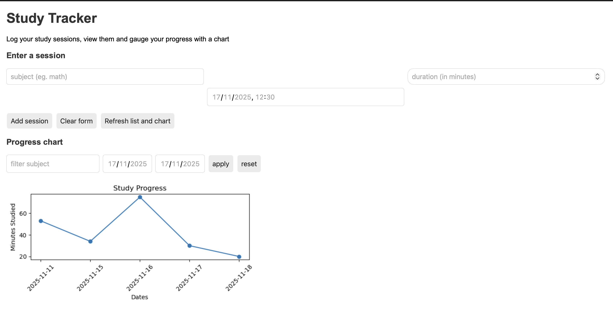

## 🧠 Study Tracker Dashboard

The Study Tracker is a simple web app that helps you log study sessions, set goals, and visualise your progress with clean charts.

### ✨ Features
- Log study sessions with time, subject, and notes  
- Track weekly and monthly study goals  
- View charts and stats about your study habits  
- Built with FastAPI + Python

### 🚀 Use It Yourself
You can clone the repository and run it locally:

```bash
git clone https://github.com/Oti-op/Study-Tracker
cd REPO-NAME
uvicorn main:app --reload


